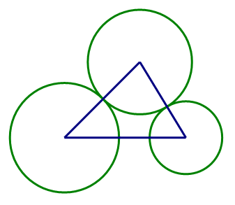
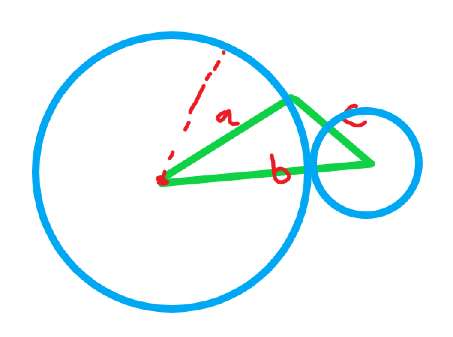

# Euclidean Geometry

## 题目描述

在某节无聊的课上，SK同学随意画了一个三角形然后用尺子量了一下，发现三边长分别为a,b,c，然后SK同学拿起圆规分别以三个顶点为圆心画了三个圆，为了使图形看上去更美观，这三个圆两两不相交也互不包含，这里认为圆的半径可以是0（称之为“点圆”），现在SK同学想知道怎么画圆才能使三个圆的面积之和最大。



## *注意*

pi=acos(-1.0)=3.141592653589793238462643383...


## 链接

[BNUOJ 52505 Euclidean Geometry](https://blog.csdn.net/weixin_34363171/article/details/94169289?spm=1001.2101.3001.6650.4&utm_medium=distribute.pc_relevant.none-task-blog-2%7Edefault%7ECTRLIST%7ERate-4.pc_relevant_antiscanv2&depth_1-utm_source=distribute.pc_relevant.none-task-blog-2%7Edefault%7ECTRLIST%7ERate-4.pc_relevant_antiscanv2&utm_relevant_index=9)

[茄子Min: 北京师范大学第十五届ACM决赛-重现赛E Euclidean Geometry （几何）](https://www.cnblogs.com/qieqiemin/p/11011384.html)

## 规律

次长边全用上，再用最长边减去次长边。

## 思路

首先我们知道圆的面积是pirr ，最终三个圆的面积和一定是一个关于r的二次函数，而且二次函数的系数a是大于0的，那么极值一定取在边界值，
再通过分析我们可以知道，对三条边排序，最大面积情况的时候一定是取中间那个边先画一个圆，然后 最大边减去中间边的值为半径再画一个圆。
如下图，面积取极值。



## 代码

```c++
#include <bits/stdc++.h>
using namespace std;
const double pi = acos(-1.0);
bool cmp(double a,double b){
    return a>b;
}
int main(){
    int n;
    scanf("%d",&n);
    for(int i=0;i<n;i++){
        double a[3];
        scanf("%lf %lf %lf",&a[0],&a[1],&a[2]);
        sort(a,a+3,cmp);
        double m=a[0]-a[1];
        double ans=pi*a[1]*a[1]+pi*m*m;
        printf("%.12lf\n",ans);
    }
    return 0;
}
```