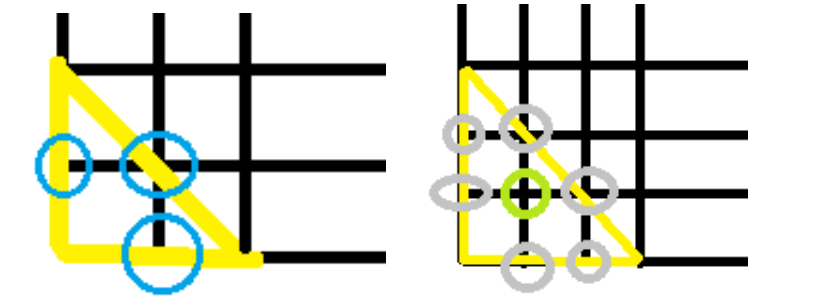

# 三角形

## 题目描述

给你一个三角形的顶点A,B,C的坐标（坐标都为整数），请求出三角形的面积，三角形内的点的个数以及边AB、BC和AC边上的点的个数（不包括顶点ABC）



## 皮克定理

2S=2a+b-2
>S三角形面积, a三角形内点的个数, b是边上点的个数。

## 代码

```c++
#include <bits/stdc++.h>
using namespace std;
#define ll long long
ll gcd(ll a,ll b){
    return b?gcd(b,a%b):a;
}
struct s{
    ll x1;
    ll y1;
    ll x2;
    ll y2;
    ll x3;
    ll y3;
}ss;
double area(ll a1,ll b1,ll a2,ll b2,ll a3,ll b3){
    double Ax=a2-a1;
    double Ay=b2-b1;
    double Bx=a3-a2;
    double By=b3-b2;
    return abs((Ax)*(By)-(Ay)*(Bx))/2;
}
ll res(ll x1,ll y1,ll x2,ll y2){
    return gcd(abs(x1-x2),abs(y1-y2))-1;
}
int main(){
    while(cin>>ss.x1>>ss.y1>>ss.x2>>ss.y2>>ss.x3>>ss.y3){
    double s=area(ss.x1,ss.y1,ss.x2,ss.y2,ss.x3,ss.y3);
    ll t1=res(ss.x1,ss.y1,ss.x2,ss.y2);
    ll t2=res(ss.x2,ss.y2,ss.x3,ss.y3);
    ll t3=res(ss.x1,ss.y1,ss.x3,ss.y3);
    ll m=t1+t2+t3+3;
    ll n=s-m/2+1;
    printf("%.1lf %lld %lld %lld %lld\n",s,n,t1,t2,t3);
    }
    return 0;
}
```