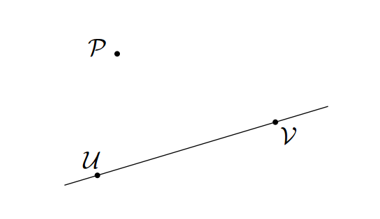

# 小马过河

## 题目描述

Etereo 开始涉猎几何领域了。他现在正在研究小马喝水问题。
众所周知，这个问题中有一匹口渴的小马，一条笔直的河，以及小马的家。小马需要去河边喝水，然后再去家里。它需要走最短的路径。



解决这个问题也很简单，其中有一个步骤是要做小马家关于河水的对称点。
Etereo正对此感到一些烦恼。他不会做这个。他想请你帮他作一条过小马家且垂直于河水的线，然后告诉Etereo垂足的位置。

## 模板

```c++
const double eps = 1e-6;
point get(point p, point a, point b){ //ab构成已知直线，p是未知直线上的一点
    double dx, dy, dz, k;
    point ans;
    dx = b.x - a.x;
    dy = b.y - a.y;
    if(abs(dx) < eps && abs(dy) < eps)
        return a;
    k = (a.x - p.x) * dx + (a.y - p.y) * dy;
    k /= dx * dx + dy * dy;
    k *= -1;
    ans.x = k * dx + a.x;
    ans.y = k * dy + a.y;
    return ans; 
}
```

## 代码

```c++
#include <bits/stdc++.h>
using namespace std;
struct point//一个结构体用来存储一个点
{
 double x,y;//分别存储点的两个坐标
 point(double x=0,double y=0):x(x),y(y){}//构造函数
};
typedef point Vector;//向量在代码中其实与点差不多，因此可以直接typedef一下
inline Vector operator + (Vector A,Vector B) {return Vector(A.x+B.x,A.y+B.y);}//向量+向量=向量
inline Vector operator - (point  A,point  B) {return Vector(A.x-B.x,A.y-B.y);}//点-点=向量
inline Vector operator * (Vector A,double x) {return Vector(A.x*x,A.y*x);}//向量*一个数=向量
inline Vector operator / (Vector A,double x) {return Vector(A.x/x,A.y/x);}//向量/一个数=向量
inline double cross(Vector A,Vector B) {return A.x*B.y-A.y*B.x;}//叉积
//判断两个线段是否交叉
bool intersection(point a,point b,point c,point d)
{
    //快速排斥实验
    if(max(c.x,d.x)<min(a.x,b.x)||max(a.x,b.x)<min(c.x,d.x)||max(c.y,d.y)<min(a.y,b.y)||max(a.y,b.y)<min(c.y,d.y)){
        return false;
    }
    //跨立实验
    if(cross(a-d,c-d)*cross(b-d,c-d)>0||cross(d-b,a-b)*cross(c-b,a-b)>0){
        return  false;
    }
    return true;
}

int main(){
    int n;
    scanf("%d",&n);
    for(int i=0;i<n;i++){
        point a,b,c,d;
        scanf("%lf %lf %lf %lf %lf %lf",&a.x,&a.y,&b.x,&b.y,&c.x,&c.y);
        //直线bc的斜率
        double kbc=(b.y-c.y)/(b.x-c.x);
        //直线bc的截距
        double bbc=kbc*b.x-b.y;
        //直线ad的斜率
        double kad=-1/kbc;
        //直线ad的截距
        double bad=kad*a.x-a.y;
        double x=(bad-bbc)/(kbc-kad);
        double y=kad*x+bad;
        
        //d=get(a,b,c);
        //printf("%.7lf %.7lf\n",d.x,d.y);
        printf("%.7lf %.7lf\n",-x,-y);
    }
    return 0;
}
```